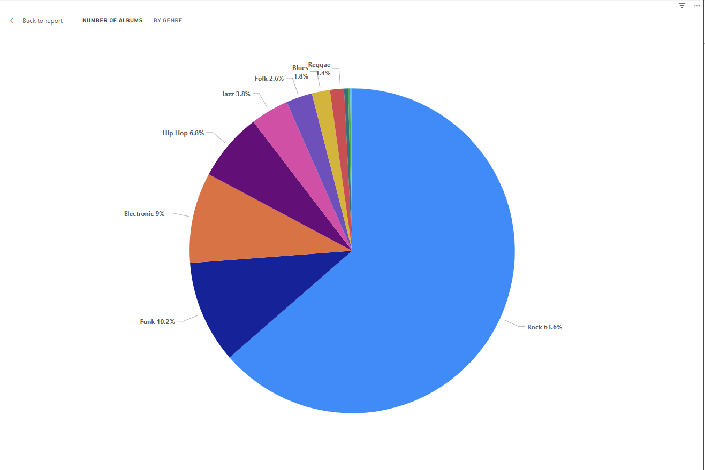
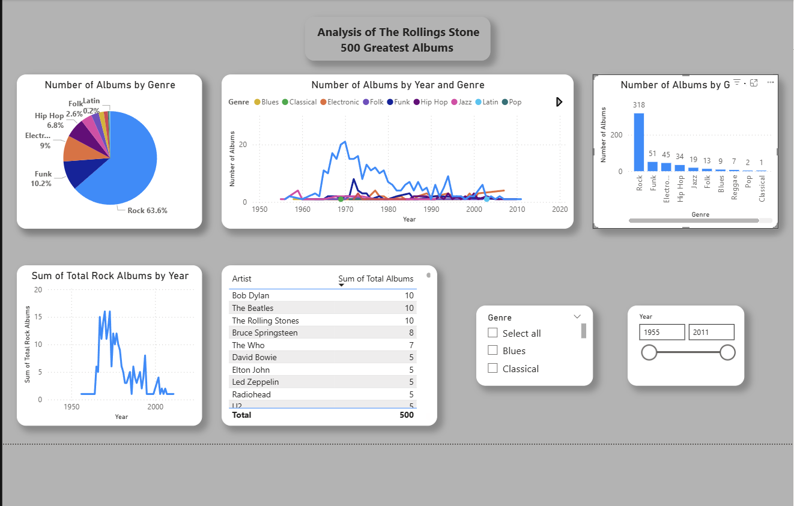

# 🎸 Rolling Stone 500 Greatest Albums — Power BI Dashboard

## 📊 Project Overview

This Power BI project analyzes the *Rolling Stone 500 Greatest Albums of All Time* list to uncover patterns in genre dominance, artist influence, and musical evolution. By combining interactive visualizations with DAX-powered insights, this dashboard tells the story of how music has shaped — and been shaped by — cultural shifts across decades.

---

## 🎯 Objectives

- Determine **which genre** dominates the list.
- Explore **how genres evolved over time**.
- Identify **artists with multiple entries** and their historical impact.

---

## 🗂 Dataset

- **Source**: [Kaggle - Rolling Stone 500 Albums](https://www.kaggle.com/datasets/joebeachcapital/rolling-stones-500-greatest-albums-of-all-time)
- Data includes: Album title, artist, release year, genre, and sub-genre.
- Cleaned and preprocessed using **Power Query** in Power BI.

---

## 🛠 Tools & Techniques

- **Power BI**: Data modeling, visual design, DAX
- **Power Query**: Data cleaning and transformation
- **DAX Functions Used**:  
  `FILTER`, `SUMMARIZE`, `COUNTAX`, `VALUES`, `EARLIER`

---

## 🧹 Data Cleaning & Preparation

- Split combined **genre and sub-genre** fields into individual tags.
- Fixed **spelling inconsistencies** using “Replace Values”.
- Ensured data types and formatting were clean and consistent.
- Transformed date fields for use in decade-based trends.

---

## 📊 Key Visualizations & Analysis

### 🎸 1. Genre Distribution

- A **pie chart** and **bar chart** show Rock’s dominance with **318 albums**.
- Sub-genres like **Psychedelic Rock**, **Folk Rock**, and **Punk** further highlight its breadth.

---

### 📈 2. Genre Evolution Over Time

- A **line chart** visualizes genre trends by decade.
- Rock declines in recent decades while **Hip Hop** and **Electronic** rise.
- Used DAX to group, filter, and count genre appearance over time.

---

### 🎤 3. Artists with Multiple Albums

- A **table view** lists artists with more than one album on the list.
- **The Beatles**, **Bob Dylan**, and **The Rolling Stones** lead with **10 entries each**.

---

## 🧩 Dashboard Features

### 🖼 Layout & Design
- Strategic placement of visuals for intuitive flow.
- Consistent font sizes, white space, and titles for clarity.

### 💡 Tooltips
- Hover-based insights added for deeper interactivity without visual clutter.

### 🔍 Slicers
- Slicers allow users to filter by:
  - Genre
  - Release Decade
  - Artist

---

## ✅ Conclusion

This Power BI dashboard provides a data-driven lens into the evolution of popular music. While **Rock dominates historically**, recent decades reflect growing diversity with the emergence of **Hip Hop** and other genres. The presence of artists with multiple entries reinforces their cultural and critical impact across generations.

As musical landscapes continue to shift, this dashboard captures an insightful snapshot of influence, taste, and legacy — making it a compelling intersection of data and art.

---

## 📁 Project Structure

rolling-stone-albums-powerbi/
- data/rolling_stone_500_cleaned.csv
- pbix/rolling_stone_dashboard.pbix
- visuals/
  - genre_pie_chart.png
  - genre_trend_line_chart.png
  - artist_album_table.png
  - full_dashboard_screenshot.png
README.md

---

## 👤 Author

**Maksymilian Leczyk**  
Data Analyst | Business Analyst | Quality Analyst  
[LinkedIn](https://www.linkedin.com/in/maksymilian-leczyk/)

---

## 📄 License & Attribution

This project is for educational and portfolio purposes.  
Dataset originally available from [Kaggle](https://www.kaggle.com/datasets/joebeachcapital/rolling-stones-500-greatest-albums-of-all-time).  
All rights to album titles and artist names belong to their respective creators.
